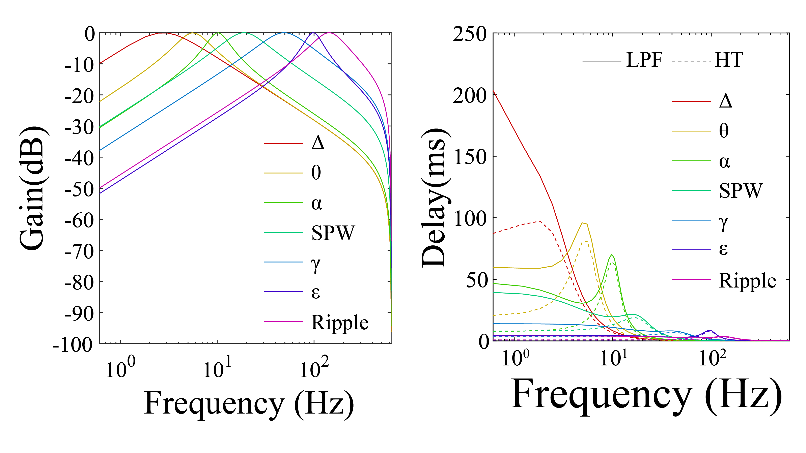

# Closed-loop Control

The system provides multiple DSP and stimulation modes for real-time closed-loop experiments.

## DSP Modes
- Disabled
- Single A
- Single A (Hilbert)
- Double
- Double (Hilbert)
- Cascade A→B
- Gated A & B
- Random
  
## Filters
One of the filter can be selected for one DSP channel (2 channels per system for now)

- Delta
- Theta
- Alpha
- Beta
- Gamma
- Epsilon
- Ripple

## Arbitrary Referencing
- Direct (x = A)
- Differential (x = A − B)
- CSD (x = 2A − B − C)

## Stimulation
- Select stimulation channels (STIM1, STIM2)
- Configure pulse width, delay, frequency
- Enable random triggering
