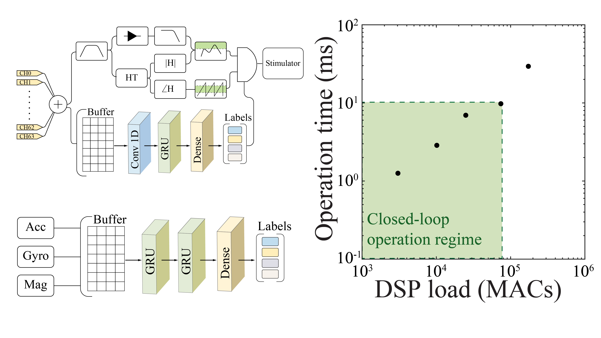

# Model-based computations(under development)
WILD supports online inference of pre-trained tensorflow-lite models.
Inference time is correlated to the model sizes.
Currently, the model is pre-compiled of the firmware, a run-time model loading mechanism is being developed.

Sample scripts of model training/developing pipelines can be found here.
