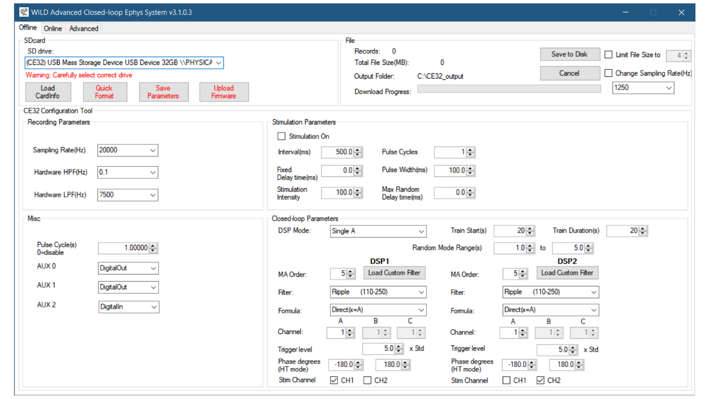
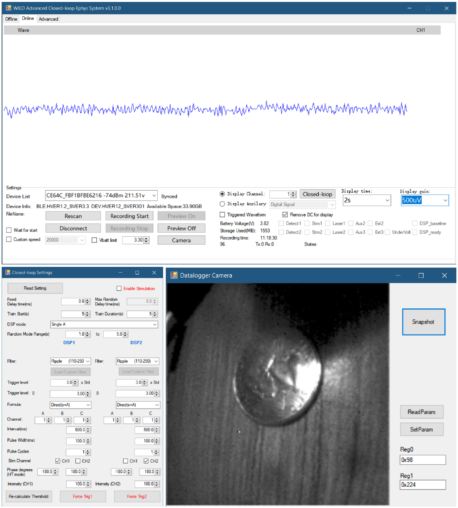

# Usage Guide
## Pre-recording preparations
1. Recharge battery
2. Format SD card using WILD_console. *Make sure WILD_console has Admin priviliage. Do not use SanDisk, we recommend Samsung EVO series(orange) or Lexar card. Avoid using high-speed SDcard as they consume much more power.
3. Insert SD card to WILD.
4. Connect battery. Device will start booting, a Blue LED will be on, indicating device started Ok and goes off to enter low power mode. If a firmware loaded to SD card, device will check the firmware image and start upgrading (LED will blink, it will take ~10s depends on the size of image).

## Connecting
1. Launch **WILD_console.exe**
2. Select device in **Port** dropdown (BLE scan).
3. Connect, wait for synchronization, a number on the bottom of the panel will increase indicating communication successful.
   *If connection is successful and syncrhonization is not started (TX number does not increase), may indicate a SDcard issue.

## Recording
1. Configure closed-loop function in Closed-loop panel
2. Configure recording speed with Custom speed drop-box
3. If need to start multiple device around same time, click **Wait for start**, will wait for other WILD_console instance without this option checked (<50ms bluetooth jitter, however, timestamp of recording start time is recorded based on calibrated high-precision clock)
4. Click **Recording Start**. Data will be start streaming in 1 second. 
5. Click **Recording Stop** after experiment finished. If battery died during the recording, the recording files will not be lost.
   
## Real-time Display
- When recording start, preview data streaming is enabled by default. Preview channels can be selected by selecting **Display Channel** or **Display Auxilary** for additional signals from IMU, DSP.
- Preview can be turned off to save power (~0.5mA) and save host-BLE bandwidths. 
- Internal state display: Shows real-time internal signals including closed-loop detection, stimulation trigger, DSP states.
- Adjustable display length: 1s, 2s, 5s, 10s
- Adjustable gain: 10 µV – 5 mV
- Threshold overlays available during closed-loop (if switched to corresponding DSP channels)
- States display device messages. TinyML model states will be shown here.

## Data Downloading
1. Insert SD card
2. Click **Save to Disk** and select the target folder. Data will be organized by recording ID and timestamp of recording start time.

## Post Processing
We have provided several processing scripts for post-processing data.
[Download here](https://github.com/ayalab1/Neurologger/tree/main/Code)  
1. To ensure the data format is consistant with conventional recording systems, naming convention and files are organized in a similar manner with Intan RHD2000 system. However, a post downloading process is still required for generating correct header and time.dat. Run WILD_PreProcess.m for this correc
ion. This will generate FMAToolbox style event files based on the digital input signal.
2. For recordings with camera, video file is stored in misc.dat in uncompressed binary file. Video decoding and post-processing can be performed with WILD_VideoDecodewAudio.py.
3. For sensor fusion of IMU data, run WILD_processIMU.m